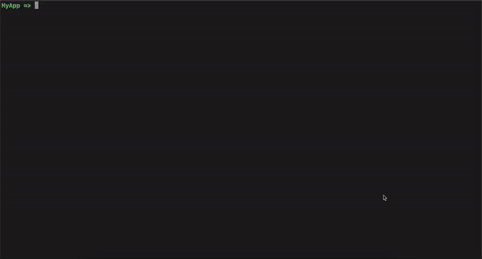

## Hello World Program


```cpp
#include <gtest/gtest.h>
#include "command-processor.h"
#include <iostream>

int main(int argc, char **argv)
{
    // initialize the command processor
    ose4g::CommandProcessor cp("MyApp");
    
    // adds a command to the command processor
    cp.add("hello",[](const ose4g::Args& args){
        if(args.size() == 0)
        {
        std::cout<<"Hello world!\n";
        return;
        }
        for(const auto &word: args)
        {
        std::cout<<"Hello "<<word<<"!\n";
        }
        
    }, "prints hello");
    cp.run();
}
```


The add function takes a function or processing command arguments and an optional description for the command.

## Adding Validation
A demo showing validation
 

```cpp
#include <gtest/gtest.h>
#include "command-processor.h"
#include <iostream>

int main(int argc, char **argv)
{
    // initialize the command processor
    ose4g::CommandProcessor cp("MyApp");

    // rules to apply
    ose4g::ArgCountRule<1,5> argumentsMustBeBetween1and5;
    ose4g::UserRule firstArgumentMustBeFlag([](const ose4g::Args& args){
        if(args[0]=="-l" || args[0]=="-r")
        {
            return std::pair{true, ""};
        }
        return std::pair{false , "expected first argument to be -l or -r"};
    });

    // adds a command with validation rules to the command processor
    cp.add("send", [](const ose4g::Args& args){
        int n = args.size();
        std::string location = args[0] == "-l" ? "localhost" : "remote host";
        for(int i = 1; i < n; i++)
        {
            std::cout<<"sending " <<args[i]<<" to "<< location <<std::endl;
        }
    }, 
    {&argumentsMustBeBetween1and5, &firstArgumentMustBeFlag}, 
    "send files to server");
    cp.run();
}
```

## History
Use the `history` command to view recent commands like on unix terminal.
Use the up and down arrow keys to move through history just like on unix terminal.